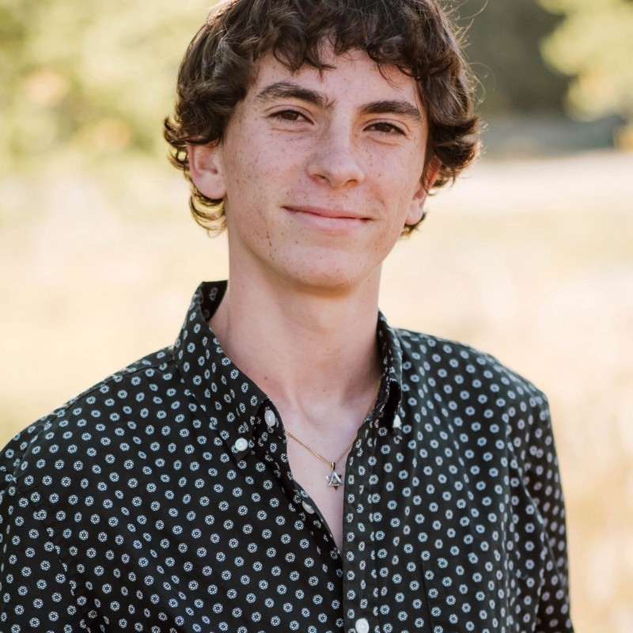
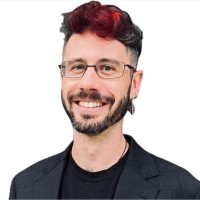
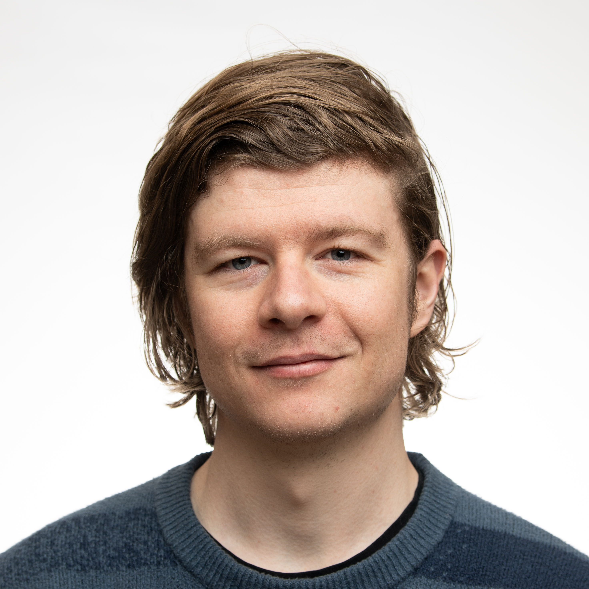

## Zach Erdley

{width=180 .rounded}

I am a Data Science Master's student from Denver, Colorado. I came to the program from a computer science undergraduate background, and I bring substantial prediction and model calibration experience to the project.

**Responsibilities:** Coordination and data

**Links:** [LinkedIn](https://www.linkedin.com/in/zach-erdley-93a091256)

---

## Dylan Hudson

{width=180 .rounded}

I'm a data scientist living in Boulder, CO. I currently lead the Threat Research team at Enzoic. I have an undergraduate background in ancient Greek philosophy and historiography, and a post-bac in computer science. I expect to graduate with my MS in Data Science from C.U. Boulder in 2027. 

**Responsibilities:** Analysis/modeling and visualization

**Links:** *Optional — GitHub, LinkedIn, or portfolio if the member chooses to share.*

---

## Mar Lonsway

{width=180 .rounded}

*Bio to be added.*

**Responsibilities:** Documentation and reproducibility

**Links:** *Optional — GitHub, LinkedIn, or portfolio if the member chooses to share.*